# Kubernetes - Dynamic Scaling with HPA and Load Testing

## Description:
This project simulates a real-world DevOps scenario where you need to deploy, configure autoscaling, and stress test a Node.js application for optimal performance.

## Table of Contents:
1. [Task 1: Kubernetes Deployment](#task-1-kubernetes-deployment)
2. [Task 2: Autoscaling with HPA](#task-2-autoscaling-with-hpa)
3. [Task 3: Resource Limits and Stress Testing](#task-3-resource-limits-and-stress-testing)
4. [Task 4: Monitoring and Documentation](#task-4-monitoring-and-documentation)
5. [Task 5: Access the website ](#task-5-access-the-website)
6. [Task 6: Stop Minikube](#task-6-stop-minikube)
---

## Task 1: Kubernetes Deployment

### Step 1: Start Minikube

```bash
minikube start
```
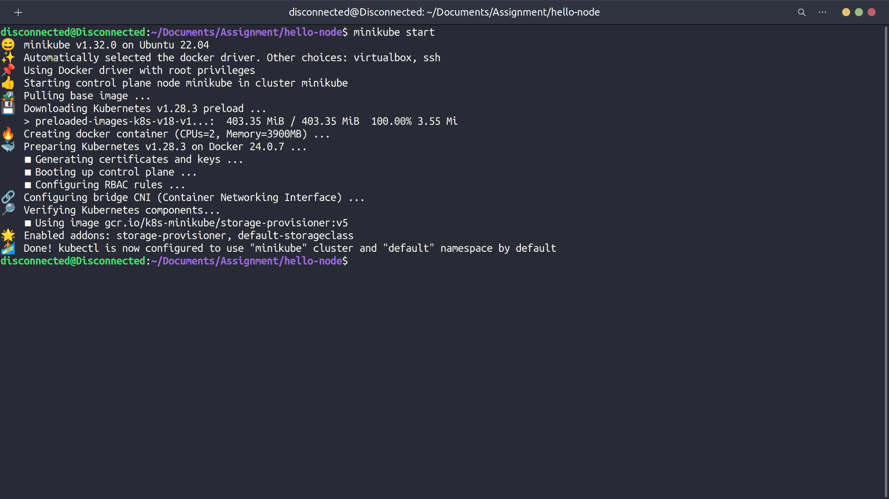

### Step 2: Test Minikube

```bash
kubectl get nodes
```
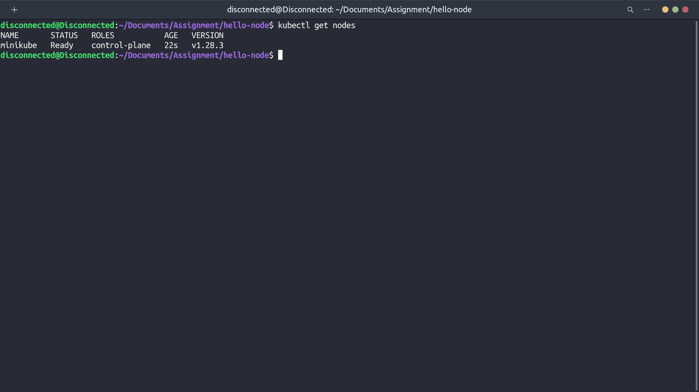

### Step 3: Prepare Node.js Codebase
- Download the Node.js codebase from the provided link.
- Extract the contents of the downloaded archive.

### Step 4: Dockerize the Node.js Application
- Navigate to the directory containing the Node.js application.
- Create a Dockerfile in the root directory of the application.

**Dockerfile:**
```Dockerfile
# Use the official Node.js image as base
FROM node:latest

# Set the working directory in the container
WORKDIR /usr/src/app

# Copy package.json and package-lock.json to the working directory
COPY package*.json ./

# Install dependencies
RUN npm install

# Copy the rest of the application code to the working directory
COPY . .

# Expose port 3000 to the outside world
EXPOSE 3000

# Command to run the application
CMD ["node", "main.js"]
```

### Step 5: Build and Push Docker Image
```bash
# Build the Docker image
docker build -t my-node-app:latest .
```
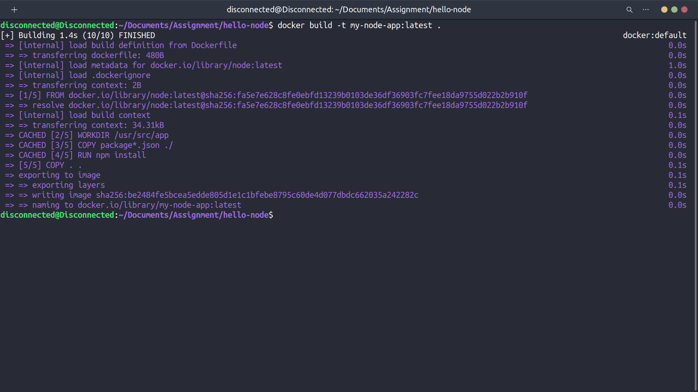

```bash
# Tag the Docker image
docker tag my-node-app:latest cgajul/my-node-app:latest

# Push the Docker image to a container registry
docker push cgajul/my-node-app:latest
```
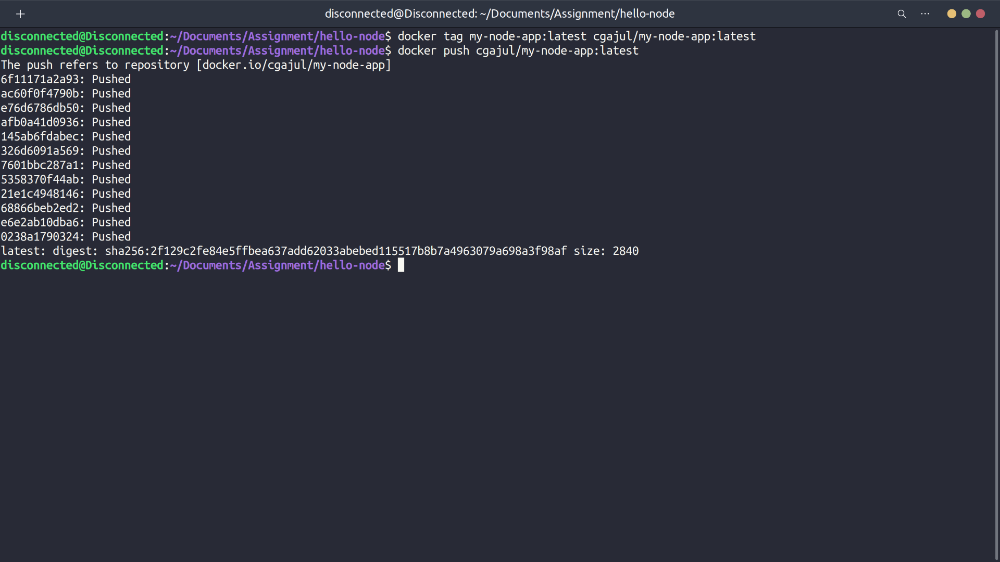

### Step 6: Create Kubernetes Deployment Manifest
- Create a file named `deployment.yaml` and define the Kubernetes deployment manifest:
```yaml
apiVersion: apps/v1
kind: Deployment
metadata:
  name: nodejs-app
spec:
  replicas: 1
  selector:
    matchLabels:
      app: nodejs
  template:
    metadata:
      labels:
        app: nodejs
    spec:
      containers:
        - name: nodejs-app
          image: cgajul/my-node-app:latest
          ports:
            - containerPort: 3000
```

### Step 7: Apply Deployment Manifest
- Apply the deployment manifest to the Kubernetes cluster:
```bash
kubectl apply -f deployment.yaml
```
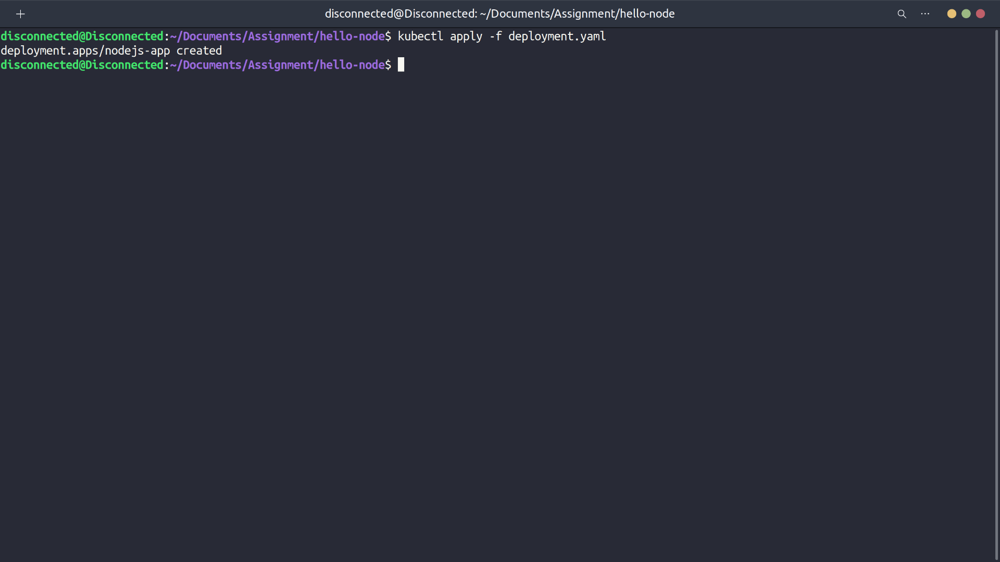
---

## Task 2: Autoscaling with HPA

### Step 1: Enable Metrics Server
- Ensure that the Kubernetes metrics server is running in your cluster. You can deploy it using the provided command.

```bash
kubectl apply -f https://github.com/kubernetes-sigs/metrics-server/releases/latest/download/components.yaml
```
### Export the EDITOR environment variable:

```bash
export EDITOR=nano
```
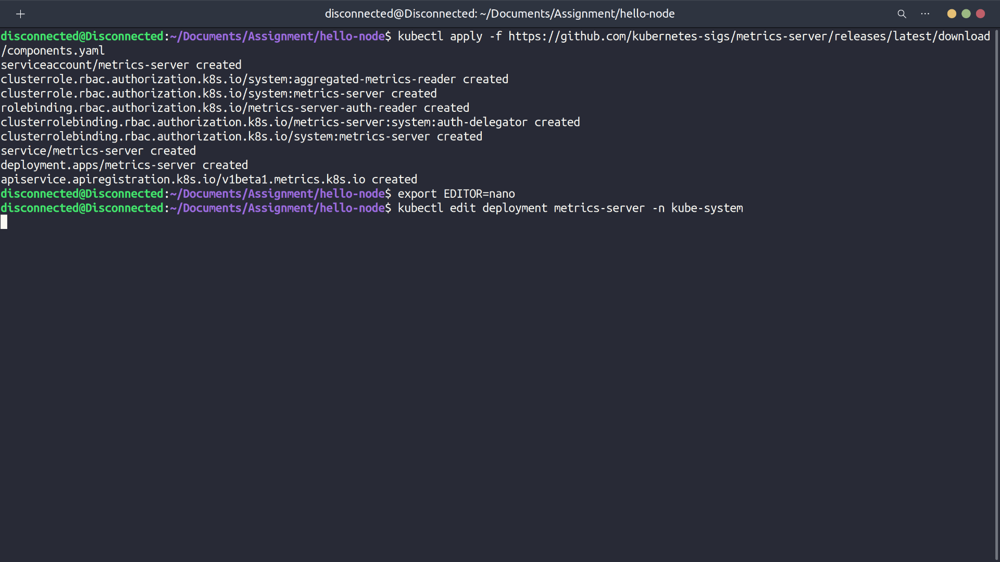

### Edit the Metrics Server deployment:
- Kubectl edit deployment metrics-server -n kube-system

- Add the --kubelet-insecure-tls flag under the args

```bash
- --kubelet-insecure-tls
```
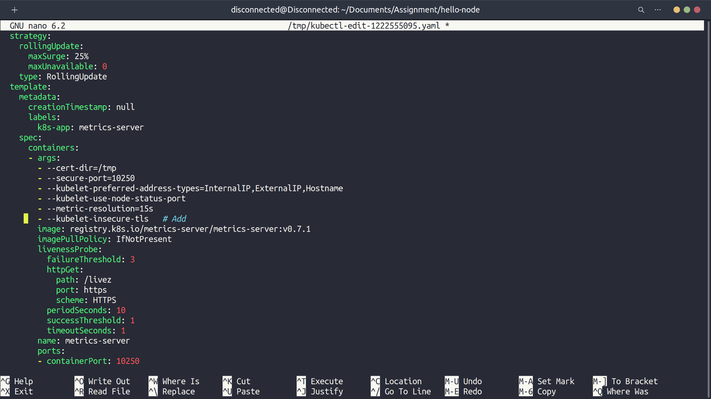

- Save the changes
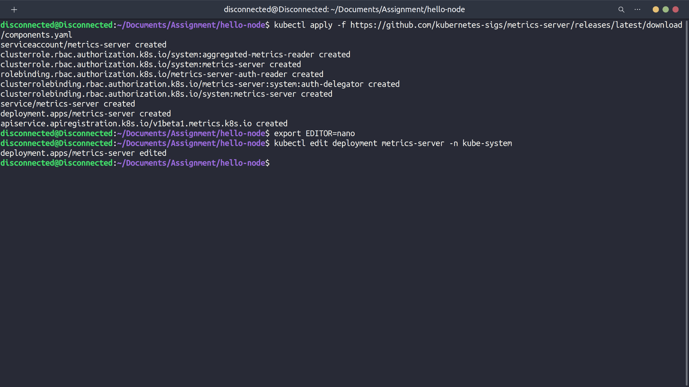

### Step 2: Write HPA Manifest
- Create a file named `hpa.yaml` and define the HorizontalPodAutoscaler (HPA) manifest:
```yaml
apiVersion: autoscaling/v2
kind: HorizontalPodAutoscaler
metadata:
  name: nodejs-app-hpa
spec:
  scaleTargetRef:
    apiVersion: apps/v1
    kind: Deployment
    name: nodejs-app
  minReplicas: 1
  maxReplicas: 10
  metrics:
    - type: Resource
      resource:
        name: cpu
        target:
          type: Utilization
          averageUtilization: 50
```
- This HPA configuration autoscales based on CPU utilization to maintain an average utilization of 50%.

### Step 3: Apply HPA Manifest
- Apply the HPA manifest to the Kubernetes cluster:
```bash
kubectl apply -f hpa.yaml
```
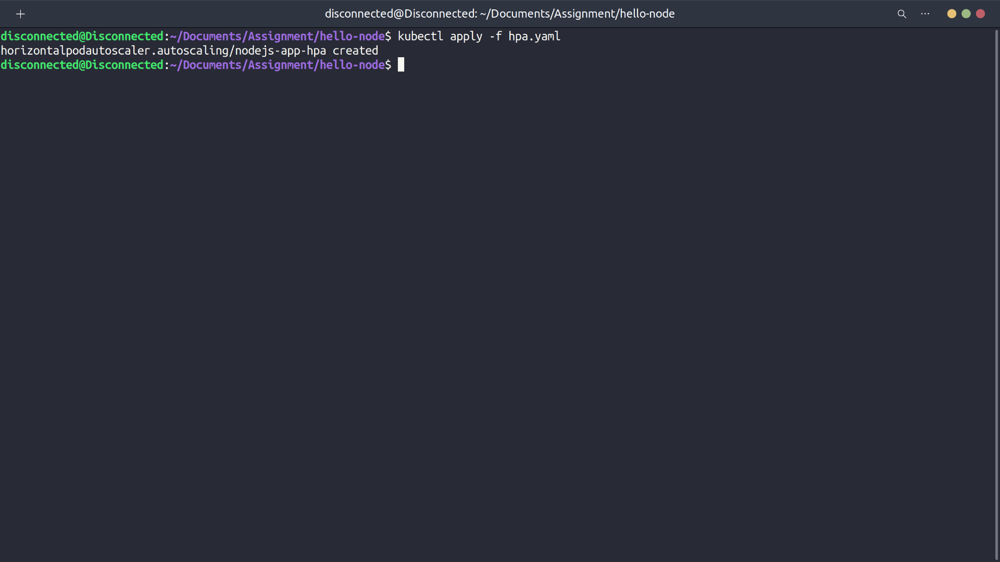

---

## Task 3: Resource Limits and Stress Testing

### Step 1: Define Resource Limitations
- Update the `deployment.yaml` file to specify resource limits (CPU and memory) for the application pods.
```yaml
resources:
  requests:
    cpu: "100m"
    memory: "128Mi"
  limits:
    cpu: "500m"
    memory: "256Mi"
```


### Step 2: Stress Test the Application
- Install a load testing tool like `hey`. 

```bash
sudo apt install hey
```
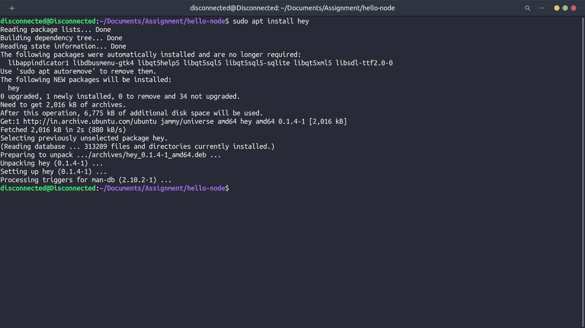

- Run the stress test against the application endpoint.

```bash
hey -n 1000 -c 100 http://192.168.49.2:31213/
```
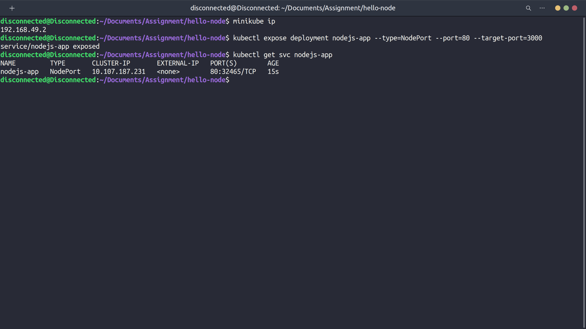

---

## Task 4: Monitoring and Documentation

### Step 1: Record Screencast
[Watch the Screencast](https://www.dropbox.com/scl/fi/vewdxbl9n2o7l6mswfg8d/Monitoring.webm?rlkey=tf3a4usvn1ekgujyxlo9pmhk7&dl=0)

### Timeline
- Load Test Start at 0.12
- Scale Up at 0.25
- Scale Down at 5.53
  
---

## Task 5: Access the website 

- Access the website from broswer
  
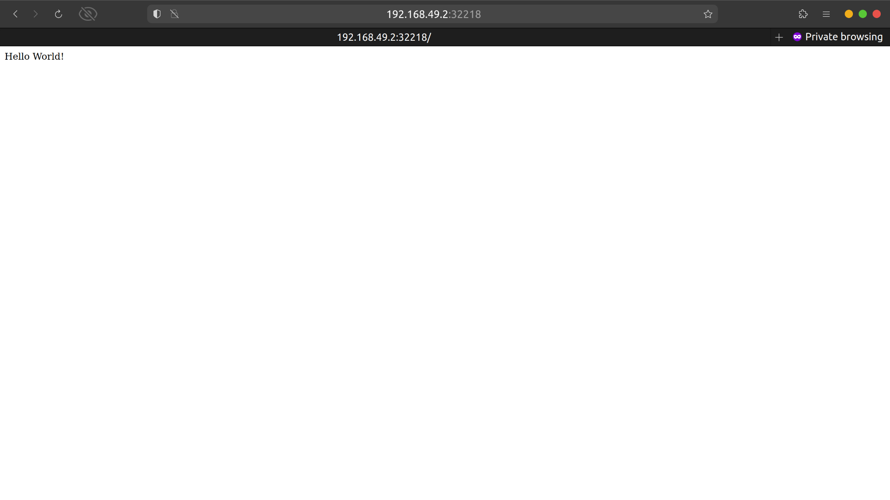

## Task 6: Stop Minikube

- Stop minikube using the following command

```bash
minikube stop
```
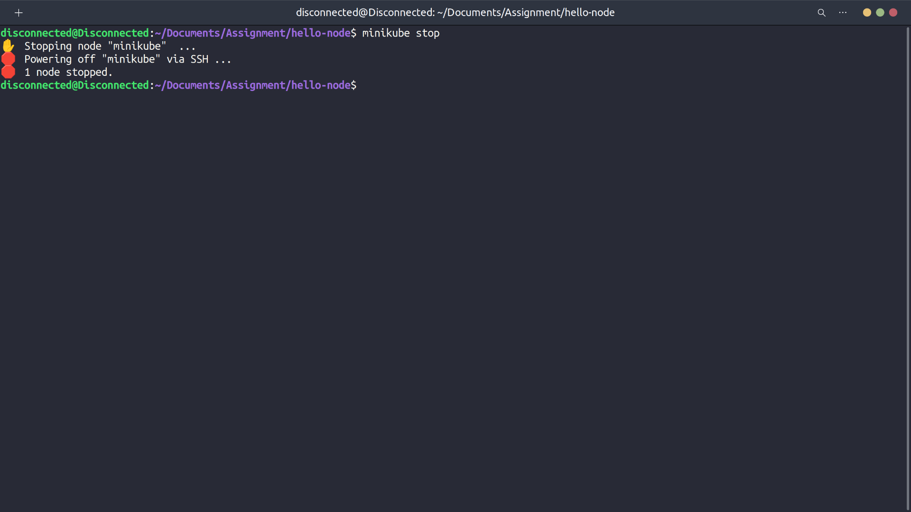

